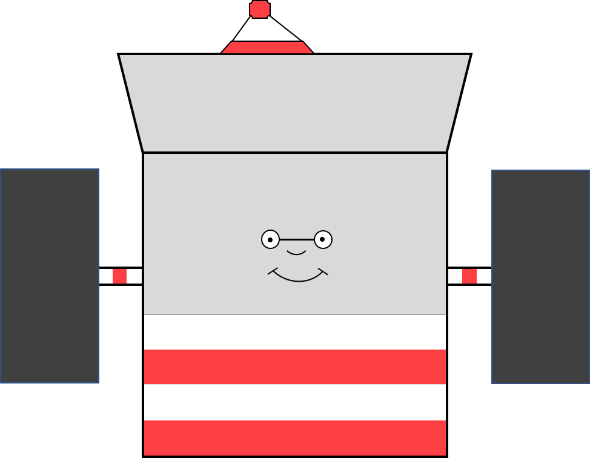

# TESS-Waldo

<p align="center">
  
  <br>
  TESS-Waldo is a tool for finding the position of a target on the TESS CCDs and Cameras.
</p>

### Installation

You can install using pip

```
pip install tess-waldo
```

### Demos

TESS-Waldo is easy to use. Check out a simple example in an ipynb [here](https://github.com/SimonJMurphy/tess-waldo/blob/master/examples/Waldo_example.ipynb).
